# 🧠 IntelliRAG: Agentic RAG Document Intelligence System

IntelliRAG is an enterprise-grade **Retrieval-Augmented Generation (RAG)** system built to provide grounded, stateful, multi-turn question answering over large PDF repositories. By incorporating **Agentic Loops** for query refinement and output validation, IntelliRAG guarantees zero-hallucination responses strictly anchored in your uploaded document context.

---

## 🏗️ System Architecture & Data Flow

IntelliRAG uses a decoupled pipeline consisting of a **Semantic Ingestion Pipeline** and an **Agentic Query-Response Loop**:

```mermaid
graph TD
    subgraph Ingestion & Vectorization
        A[Raw PDF Documents] -->|PyPDF Parsing| B[Extract Plain Text]
        B -->|Sliding Window Chunking| C[400 Chars / 50 Chars Overlap]
        C -->|Gemini Embedding API| D[RETRIEVAL_DOCUMENT Vector Spaces]
        D -->|FAISS Euclidean Index| E[faiss.IndexFlatL2]
        E -->|Serialization| F[vector_store.pkl Local Cache]
    end

    subgraph Agentic Query-Response Loop
        G[User Conversational Input] -->|History Window| H[Agent #1: Query Rewriter]
        H -->|Rewrite to Factual Query| I[Gemini Embedding API: RETRIEVAL_QUERY]
        I -->|FAISS Similarity Search| J[Retrieve Top-K Chunks]
        J -->|Inject Context & Memory| K[Gemini Flash Generator]
        K -->|Draft Response| L{Agent #2: Validation Switch}
        L -->|Enabled: Verify Answer| M{Self-Corrective Verdict}
        M -->|SUPPORTED| N[Final Grounded Answer]
        M -->|NOT_SUPPORTED| O[Fallback: 'I don't know']
        L -->|Disabled: Direct Output| N
    end
```



---

## ⚡ Core Technical Features

* **Agentic Query Refinement**: Utilizes a specialized LLM agent to preprocess and rewrite conversational or ambiguous user queries into factual search queries, significantly increasing the recall rate of relevant vector chunks.
* **Dual-Task Embeddings**: Leverages the Gemini Embeddings API (`models/gemini-embedding-001`) with distinct task types: `RETRIEVAL_DOCUMENT` for generating stable vector spaces of static chunks, and `RETRIEVAL_QUERY` for matching dynamic questions.
* **Persistent Vector Store Caching**: Saves computed FAISS embeddings and text chunks locally in a serialized pickle cache (`/tmp/cache/vector_store.pkl`). This prevents redundant API requests and guarantees near-zero boot times on subsequent startup cycles.
* **Self-Corrective Output Verification**: Includes an optional verification agent that cross-checks draft responses against the raw retrieved text chunks. If the response contains assertions not fully supported by the document, it is blocked and replaced with a safe fallback response.
* **Sliding Conversation Memory**: Tracks and maintains a sliding window of the last 3 dialogue turns, allowing the LLM generator to resolve follow-up inquiries that depend on context from prior exchanges.
* **Next-Gen Premium UI**: A highly polished, frosted glassmorphism interface styled in cosmic dark colors. Includes an active document library, live pipeline agent status indicators, drag-and-drop file uploaders, and client-side Markdown rendering (via `marked.js`).

---

## 📂 Codebase Navigation & Components

* [**`app.py`**](file:///c:/Users/kk/OneDrive%20-%20BENNETT%20UNIVERSITY/Desktop/Projects/DocMind-AI-Agentic-RAG-Document-Intelligence-System-main/app.py): Entry point for the Flask web application. Orchestrates web routing, state serialization, file uploads, and session clearing.
* [**`templates/index.html`**](file:///c:/Users/kk/OneDrive%20-%20BENNETT%20UNIVERSITY/Desktop/Projects/DocMind-AI-Agentic-RAG-Document-Intelligence-System-main/templates/index.html): High-fidelity frosted-glass user interface with Markdown support and drag-and-drop listeners.
* [**`src/rag_core.py`**](file:///c:/Users/kk/OneDrive%20-%20BENNETT%20UNIVERSITY/Desktop/Projects/DocMind-AI-Agentic-RAG-Document-Intelligence-System-main/src/rag_core.py): Production-grade RAG core. Manages FAISS vector indexing, Gemini embedding requests, agentic query rewriting, conversation memory, and answer generation/verification.
* [**`src/chunk_and_retrieve.py`**](file:///c:/Users/kk/OneDrive%20-%20BENNETT%20UNIVERSITY/Desktop/Projects/DocMind-AI-Agentic-RAG-Document-Intelligence-System-main/src/chunk_and_retrieve.py): Offline prototyping playground for document parsing, sliding-window chunking, and similarity search using local models (`sentence-transformers`).
* [**`src/rag_answer.py`**](file:///c:/Users/kk/OneDrive%20-%20BENNETT%20UNIVERSITY/Desktop/Projects/DocMind-AI-Agentic-RAG-Document-Intelligence-System-main/src/rag_answer.py): Standalone script displaying local RAG generations using `sentence-transformers` for retrieval and a local GGUF LLM run via `ctransformers`.
* [**`test_rag_api.py`**](file:///c:/Users/kk/OneDrive%20-%20BENNETT%20UNIVERSITY/Desktop/Projects/DocMind-AI-Agentic-RAG-Document-Intelligence-System-main/test_rag_api.py): Command-line test suite to verify embedding pipelines, file parsing, and generation loops without running a web server.
* [**`detail.md`**](file:///c:/Users/kk/OneDrive%20-%20BENNETT%20UNIVERSITY/Desktop/Projects/DocMind-AI-Agentic-RAG-Document-Intelligence-System-main/detail.md): Exhaustive engineering handbook describing architectural decisions, data schemas, and deployment methods.

---

## 🛠️ Environment Configuration & Installation

### Prerequisites
* Python 3.10 or higher
* Docker & Docker Compose (Optional, for containerized runtimes)
* A Google Gemini API Key

### 1. Configure Local Environment
Create a `.env` file in the root of your project:
```env
GEMINI_API_KEY=your_google_gemini_api_key_here
```

---

### 2. Method A: Local Setup (Native Execution)

#### Create a Virtual Environment
```bash
python -m venv venv
```

Activate the environment:
* **On Windows (PowerShell/CMD)**:
  ```powershell
  .\venv\Scripts\activate
  ```
* **On macOS / Linux**:
  ```bash
  source venv/bin/activate
  ```

#### Install Dependencies & Start Server
```bash
# Install core dependencies
pip install -r requirements.txt

# Start the Flask web application
python app.py
```
Open **`http://localhost:5001`** in your browser.

> [!NOTE]
> On Windows, the application resolves path configs like `/tmp/docs` and `/tmp/cache` to the root of your active hard drive (e.g., `C:\tmp\docs` and `C:\tmp\cache`).

---

### 3. Method B: Docker Deployment (Containerized)

To build and run the application inside an isolated Docker container with multi-volume bindings for index persistence:

```bash
# Build the image and start the container service
docker-compose up --build
```
Open **`http://localhost:5001`** in your browser.

* Docker mounts volume folders `rag_cache` and `rag_docs` internally mapping to `/tmp/cache` and `/tmp/docs`. This ensures your uploaded PDFs and computed vector databases persist across container restarts.

---

### 4. Method C: Serverless Deployment (Vercel)

IntelliRAG is pre-configured with a [**`vercel.json`**](file:///c:/Users/kk/OneDrive%20-%20BENNETT%20UNIVERSITY/Desktop/Projects/DocMind-AI-Agentic-RAG-Document-Intelligence-System-main/vercel.json) file for rapid serverless deployment using the `@vercel/python` builder.

1. Install the Vercel CLI globally or use the GitHub integration:
   ```bash
   npm install -g vercel
   ```
2. Run the initialization command in the project root:
   ```bash
   vercel
   ```
3. Set the `GEMINI_API_KEY` environment variable in your Vercel Dashboard, then deploy to production:
   ```bash
   vercel --prod
   ```

> [!WARNING]
> **Serverless Statelessness Warning**: Vercel Serverless Functions have ephemeral filesystems. Any files uploaded to `/tmp/docs` and FAISS caches saved to `/tmp/cache` will be lost when the function spins down (after a few minutes of inactivity). This setup is ideal for sandbox testing. For permanent filesystems, configure cloud databases (e.g., Supabase or Pinecone).

---

## 🧪 Running the Verification Suite

Run the testing utility to check embedding responses, local vector indexing, and pipeline grounding:
```bash
python test_rag_api.py
```

---

## 📈 Future Architectural Roadmap

* **Hybrid Search integration**: Combine FAISS dense similarity embeddings with sparse BM25 keyword matching for high-recall retrieval.
* **Observability Dashboards**: Integrate tracing suites like LangSmith or Arize Phoenix to trace agent prompts, costs, latencies, and token usages.
* **Persistent DB Migration**: Transition the local FAISS FlatL2 database to cloud-native vector indexes (e.g. Supabase PgVector or Pinecone) to facilitate scalability and multi-tenant systems.
