# IntelliRAG: Deep-Dive Project Walkthrough & Workflow Manual

Welcome to the detailed system documentation for **IntelliRAG: Agentic RAG Document Intelligence System**. This document provides an exhaustive breakdown of the project architecture, files, core agentic workflows, execution modes, and instructions on how to run and test the application.

---

## 1. Project Overview & Architecture

IntelliRAG is a modern **Retrieval-Augmented Generation (RAG)** application. Unlike standard RAG pipelines that simply retrieve text chunks and feed them to an LLM, IntelliRAG introduces **Agentic workflows** to optimize retrieval quality and guarantee grounded answers. 

### High-Level Architecture

```mermaid
graph TD
    subgraph Ingestion & Indexing Phase
        A[User Uploads PDF] --> B[PyPDF Extraction]
        B --> C[Sliding Window Chunking]
        C --> D[Gemini Embeddings API: RETRIEVAL_DOCUMENT]
        D --> E[FAISS Vector Index]
        E --> F[Pickle Cache: vector_store.pkl]
    end

    subgraph Query & Answer Phase
        G[User Query] --> H[Agentic Query Rewriter]
        H --> I[Gemini Embeddings API: RETRIEVAL_QUERY]
        I --> J[FAISS Similarity Search]
        J --> K[Retrieve Top K Chunks]
        K --> L[Inject Last 3 Turns of Chat Memory]
        L --> M[System Grounded Prompt]
        M --> N[Gemini Flash Generator]
        M --> N[Gemini Flash Generator]
        N --> O[Optional: Output Verification Agent]
        O -- Validated --> P[Final Answer to User]
        O -- Ungrounded / Hallucinated --> Q[Fallback: I don't know]
    end
```


---

## 2. File Directory & Core Module Analysis

The workspace is organized into a clean structure separating the web server, prototype playground scripts, and the production-ready core source code:

| File / Directory | Type | Description |
| :--- | :--- | :--- |
| **`app.py`** | Python File | The Flask web application entry point. Handles web routes (`/`), file uploads, chat requests, and templates. |
| [**`templates/index.html`**](file:///c:/Users/kk/OneDrive%20-%20BENNETT%20UNIVERSITY/Desktop/Projects/DocMind-AI-Agentic-RAG-Document-Intelligence-System-main/templates/index.html) | HTML Template | The visual frontend using a futuristic Dark Mode UI, HSL-tailored colors, smooth animations, and Lucide icons. |
| [**`src/rag_core.py`**](file:///c:/Users/kk/OneDrive%20-%20BENNETT%20UNIVERSITY/Desktop/Projects/DocMind-AI-Agentic-RAG-Document-Intelligence-System-main/src/rag_core.py) | Python File | **The Core Production System**. Implements Google Gemini APIs (via the new `google-genai` SDK) for embeddings, agentic query rewriting, answer generation, and output verification. |
| [**`src/chunk_and_retrieve.py`**](file:///c:/Users/kk/OneDrive%20-%20BENNETT%20UNIVERSITY/Desktop/Projects/DocMind-AI-Agentic-RAG-Document-Intelligence-System-main/src/chunk_and_retrieve.py) | Python File | **Standalone Local Prototype (Playground)**. Demonstrates how parsing, chunking, embedding, and similarity search work using local models (`sentence-transformers`). |
| [**`src/rag_answer.py`**](file:///c:/Users/kk/OneDrive%20-%20BENNETT%20UNIVERSITY/Desktop/Projects/DocMind-AI-Agentic-RAG-Document-Intelligence-System-main/src/rag_answer.py) | Python File | **Standalone Local Prototype (Playground)**. Demonstrates complete local RAG flow by using `sentence-transformers` for retrieval and a local GGUF model via `ctransformers`. |
| [**`test_rag_api.py`**](file:///c:/Users/kk/OneDrive%20-%20BENNETT%20UNIVERSITY/Desktop/Projects/DocMind-AI-Agentic-RAG-Document-Intelligence-System-main/test_rag_api.py) | Python File | CLI validation script to test the `RAGSystem` pipeline without launching the Flask web server. |
| **`requirements.txt`** | Configuration | List of Python dependencies for the production Flask app (`google-genai`, `flask`, `faiss-cpu`, `pypdf`, `numpy`, `python-dotenv`, `gunicorn`). |
| **`Dockerfile`** | Container Config | System configuration for building an isolated, production-grade container image running Gunicorn. |
| **`docker-compose.yml`** | Multi-Container Orchestration | Binds ports and sets up persistent local volumes (`rag_docs` and `rag_cache`) to store indexes and files. |
| **`vercel.json`** | Deployment Config | Routing and build options for deploying the Flask backend to Vercel Serverless Functions. |
| **`data/docs/`** | Directory | Root folder containing static PDFs like `sample_company_policy.pdf`. |

---

## 3. Deep Dive: The Production Agentic RAG Workflow (`src/rag_core.py`)

The primary intelligence engine lives in `src/rag_core.py`. Let's step through its exact processing sequence:

### Step 1: PDF Document Parsing
When the application starts (or a new PDF is uploaded), the system searches the `/tmp/docs` folder. It reads each PDF using `pypdf`'s `PdfReader`, extracting raw strings page by page.

### Step 2: Sliding Window Chunking
To ensure sentences and context are not awkwardly cut off, the extracted text is segmented using a sliding window chunking algorithm. 
* **Chunk Size**: 400 characters
* **Overlap Size**: 50 characters (retains context across block boundaries)

### Step 3: Embeddings Generation & Task Types
IntelliRAG uses the **Google Gemini Embeddings model** (`models/gemini-embedding-001`). Crucially, it adheres to embedding best practices by applying task-specific types:
* **`RETRIEVAL_DOCUMENT`**: Used when embedding document chunks to format the vector index database.
* **`RETRIEVAL_QUERY`**: Used when embedding the search query, optimising similarity calculations.

### Step 4: Vector Storage with FAISS
The system loads the float32 embeddings into an **L2 Euclidean Distance ($L_2$) FAISS Index** (`faiss.IndexFlatL2`). FAISS facilitates microsecond similarity searches over hundreds of thousands of document embeddings.

### Step 5: Persistent Vector Store Caching
To prevent calling Gemini's API to rebuild embeddings on every web request or server reboot, the index is stored locally:
* **Cache Destination**: `/tmp/cache/vector_store.pkl`
* **Contents**: A serialized tuple containing `(self.chunks, self.index)`.
* When booting up, the system check if the `.pkl` cache exists. If it does, it deserializes the cache instantly instead of regenerating embeddings.

### Step 6: Agentic Query-Rewriting (Agent #1)
Conversational search questions are often ambiguous or contain pronouns referring to previous turns. To ensure optimal retrieval accuracy, IntelliRAG routes queries through an LLM Agent to transform them into clear, search-engine-friendly queries.

### Step 7: Dialogue Memory Context Window
To support conversational flow, the system stores the chat logs and retrieves the **last 3 turns** of the conversation history to format into the final prompt alongside the retrieved context.

### Step 8: Grounded Answer Generation
The retrieved context and memory are packaged with strict LLM instructions to prevent hallucinations.

### Step 9: Self-Corrective Answer Verification Agent (Agent #2)
To achieve zero hallucination tolerance, the output can be cross-verified against the retrieved raw context by a second agentic verification step.

---

## 4. Comparing the RAG Implementations

The repository has two distinct implementation paths. Only **Path A** is utilized in the active Flask Web App. 

| Dimension | Path A: Production RAG (`src/rag_core.py`) | Path B: Playground Prototypes (`chunk_and_retrieve.py` / `rag_answer.py`) |
| :--- | :--- | :--- |
| **Target Engine** | Web App (`app.py`), APIs, & Production CLI | Developer Playground / Local Prototyping |
| **Embeddings** | Gemini API (`models/gemini-embedding-001`) | Local CPU-bound `sentence-transformers` (`all-MiniLM-L6-v2`) |
| **LLM Model** | Gemini Flash API (`models/gemini-flash-latest`) | Local CPU-bound model (`mistral.gguf`) run via `ctransformers` |
| **Agentic Loop** | Query Rewriting + Output Validation Agents | None (Standard direct retrieval and answer) |
| **State & Memory** | Persistent dialogue history (sliding window of 3 turns) | None (Single turn QA) |
| **Caching** | Caches FAISS Index & Chunk mapping to pickle files | None |

---

## 5. How to Run the Project

### Setup Environment Variables
Before running the project locally or via Docker, create a `.env` file in the root directory.

---

### Method A: Running Locally (Python Environment)

#### 1. Create a Virtual Environment
Navigate to the root directory and create a virtual environment:
```bash
python -m venv venv
```
Activate the environment:
* **On Windows (Command Prompt / PowerShell)**: `.\venv\Scripts\activate`
* **On macOS / Linux**: `source venv/bin/activate`

#### 2. Install Dependencies
```bash
pip install -r requirements.txt
```

#### 3. Execution Options
* **Run the Web Server**: `python app.py` (Runs on port 5001)
* **Run the Pipeline Verification CLI**: `python test_rag_api.py`

#### 4. File Path Behavior on Windows
Because Flask configures the upload folder to `/tmp/docs` and the cache folder to `/tmp/cache`, Windows will create these directories at the root of the active hard drive.
* **Uploaded Files location**: `C:\tmp\docs`
* **Cached Indexes location**: `C:\tmp\cache`

---

### Method B: Running via Containerized Docker Deployment
```bash
docker-compose up --build
```
Open **`http://localhost:5001`**.

---

### Method C: Deploying to Vercel (Serverless)

IntelliRAG is pre-configured for deployment on Vercel using the `@vercel/python` builder.

#### 1. Setup Vercel Configuration
Ensure the `vercel.json` file exists at the root of the project with the following structure:
```json
{
  "version": 2,
  "builds": [
    {
      "src": "app.py",
      "use": "@vercel/python"
    }
  ],
  "routes": [
    {
      "src": "/(.*)",
      "destination": "app.py"
    }
  ]
}
```

#### 2. Deployment Steps (GitHub Integration - Recommended)
1. Commit and push the project repository to GitHub.
2. Log into the Vercel Dashboard and click Add New > Project.
3. Import your GitHub repository.
4. Add environment variable `GEMINI_API_KEY`.
5. Click Deploy.

> [!WARNING]
> **Serverless File System Limitations (Statelessness)**:
> Vercel Serverless Functions are ephemeral and stateless. The filesystem is read-only except for the `/tmp` folder.
> * Files uploaded to `/tmp/docs` and FAISS vector caches stored in `/tmp/cache` are **temporary** and will be deleted whenever the serverless container spins down (after a few minutes of inactivity) or when multiple requests trigger container scaling.
